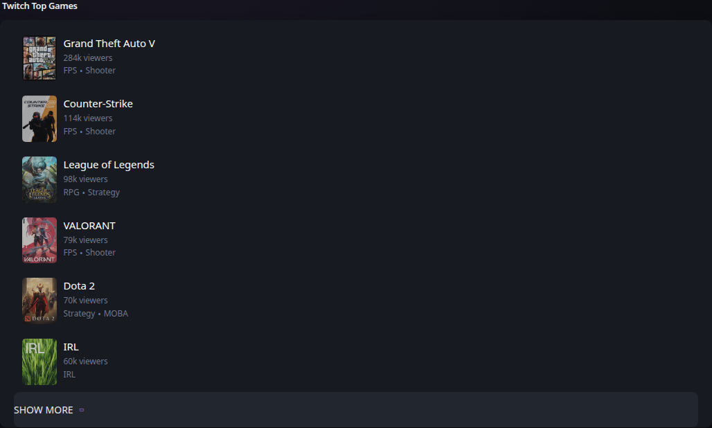

# Twitch top games

[Widgets](../widgets.md) · [Configuration](../configuration.md) · [Glance README](../../README.md)

Display a list of games with the most viewers on Twitch.

Example:
## Quick start


```yaml
- type: twitch-top-games
  exclude:
    - just-chatting
    - pools-hot-tubs-and-beaches
    - music
    - art
    - asmr
```

Preview:



## Configuration

This widget also supports the [shared widget properties](../widgets.md#shared-properties).
| Name | Type | Required | Default |
| ---- | ---- | -------- | ------- |
| exclude | array | no | |
| limit | integer | no | 10 |
| collapse-after | integer | no | 5 |

### `exclude`
A list of categories that will never be shown. You must provide the slug found by clicking on the category and looking at the URL:

```
https://www.twitch.tv/directory/category/grand-theft-auto-v
                                         ^^^^^^^^^^^^^^^^^^
```

### `limit`
The maximum number of games to show.

### `collapse-after`
How many games are visible before the "SHOW MORE" button appears. Set to `-1` to never collapse.


---

[Widgets](../widgets.md) · [Configuration](../configuration.md) · [Back to top](#twitch-top-games)
