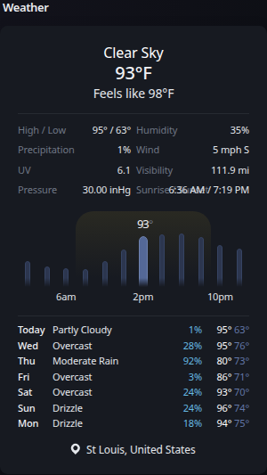

# Weather

[Widgets](../widgets.md) · [Configuration](../configuration.md) · [Glance README](../../README.md)

Display current conditions, weather details, hourly temperatures and precipitation, and a 7-day forecast for a specific location. The data is provided by https://open-meteo.com/.

## Quick start

```yaml
- type: weather
  units: metric
  hour-format: 12h
  location: London, United Kingdom
  show-current: true
  show-details: true
  show-hourly: true
  show-forecast: true
```

> [!NOTE]
>
> US cities which have common names can have their state specified as the second parameter as such:
>
> * Greenville, North Carolina, United States
> * Greenville, South Carolina, United States
> * Greenville, Mississippi, United States

## Preview



The widget can display four independently configurable sections: current conditions, weather details, an hourly temperature and precipitation graph, and a 7-day forecast. All four sections are enabled by default.

In the hourly graph, each bar represents a 2 hour interval. The background highlight represents daylight between sunrise and sunset, and precipitation markers identify periods with a high chance of precipitation. You can hover over the bars to view the exact temperature for that time.

## Configuration

This widget also supports the [shared widget properties](../widgets.md#shared-properties).

| Property | Type | Required | Default |
| --- | --- | --- | --- |
| `location` | string | yes | — |
| `units` | string | no | `metric` |
| `hour-format` | string | no | `12h` |
| `hide-location` | boolean | no | `false` |
| `show-area-name` | boolean | no | `false` |
| `show-current` | boolean | no | `true` |
| `show-details` | boolean | no | `true` |
| `show-hourly` | boolean | no | `true` |
| `show-forecast` | boolean | no | `true` |

### `location`
The name of the city and country to fetch weather information for. Attempting to launch the application with an invalid location will result in an error. You can use the [geocoding API page](https://open-meteo.com/en/docs/geocoding-api) to search for your specific location. Glance will use the first result from the list if there are multiple.

### `units`
Whether to show weather measurements using metric or imperial units. Possible values are `metric` and `imperial`.

### `hour-format`
Whether to show the hours of the day in 12-hour format or 24-hour format. Possible values are `12h` and `24h`.

### `hide-location`
Optionally do not display the location name on the widget.

### `show-area-name`
Whether to display the state/administrative area in the location name. If set to `true` the location will be displayed as:

```
Greenville, North Carolina, United States
```

Otherwise, if set to `false` (which is the default) it will be displayed as:

```
Greenville, United States
```

### `show-current`
Whether to display the current weather condition, temperature, and apparent temperature.

### `show-details`
Whether to display the compact weather details section, including the daily high and low temperatures, humidity, precipitation probability, wind, UV index, visibility, pressure, sunrise, and sunset.

### `show-hourly`
Whether to display the hourly temperature and precipitation graph.

### `show-forecast`
Whether to display the 7-day forecast. The forecast includes today and the following six days.


---

[Widgets](../widgets.md) · [Configuration](../configuration.md) · [Back to top](#weather)
