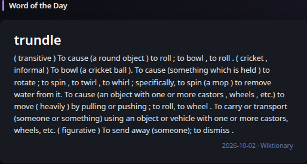

# Word of the Day

[Widgets](../widgets.md) · [Configuration](../configuration.md) · [Glance README](../../README.md)

Display the curated English Wiktionary Word of the Day. The widget fetches the official Atom feed server-side and extracts plain structured text rather than rendering provider HTML.

## Quick start

```yaml
- type: word-of-the-day
```

Preview:



## Configuration

This widget supports the [shared widget properties](../widgets.md#shared-properties). It requires no API key. By default it refreshes shortly after midnight using `cache-cron: 5 0 * * *`; normal cache overrides remain available. Later provider failures preserve previously successful content through Glance stale/degraded behavior.

---

[Widgets](../widgets.md) · [Configuration](../configuration.md) · [Back to top](#word-of-the-day)
